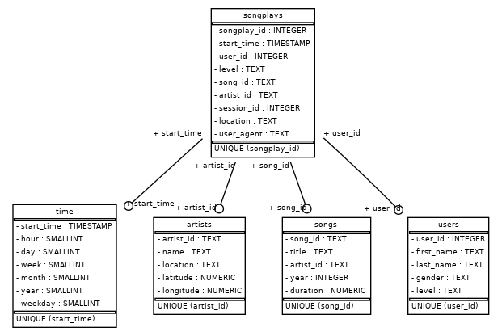
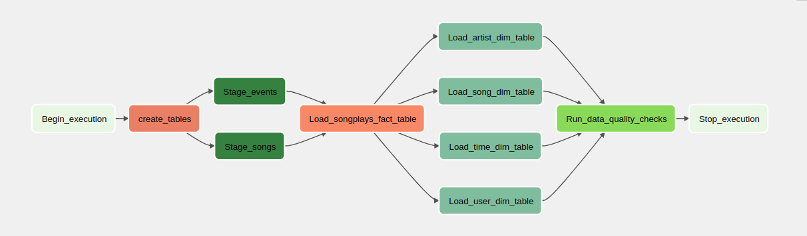

# Sparkify ETL Pipeline with Apache Airflow

A music streaming company, Sparkify, has decided that it is time to introduce more automation and monitoring to their data warehouse ETL pipelines and come to the conclusion that the best tool to achieve this is Apache Airflow.

They have decided to bring you into the project and expect you to create high-grade data pipelines that are dynamic and built from reusable tasks, can be monitored, and allow easy backfills. They have also noted that data quality plays a big part when analyses are executed on top of the data warehouse and want to run tests against their datasets after the ETL steps have been executed to catch any discrepancies in the datasets.

The source data resides in S3 and needs to be processed in Sparkify's data warehouse in Amazon Redshift. The source datasets consist of JSON logs that tell about user activity in the application and JSON metadata about the songs the users listen to.

## Project Structure

The project directory contains the following files:

- `dags/sparkify_etl.py`: Airflow DAG definition file that contains the tasks to be executed.
- `plugins/helpers.py`: Helper functions for the ETL pipeline.
- `plugins/operators/create_table.py`: Operator to create tables in the Redshift database.
- `plugins/operators/load_dimension.py`: Operator to load dimension tables in the Redshift database.
- `plugins/operators/load_fact.py`: Operator to load the fact table in the Redshift database.
- `plugins/operators/stage_redshift.py`: Operator to stage data from S3 to Redshift.
- `plugins/operators/data_quality.py`: Operator to perform data quality checks.

<!--  -->

        

## Running the ETL Pipeline

To run the ETL pipeline, follow the steps below:

1. Clone the repository to your local machine.
2. Install the required dependencies by running `pip install -r requirements.txt` in your terminal.
3. Set your AWS credentials as environment variables `AWS_ACCESS_KEY_ID` and `AWS_SECRET_ACCESS_KEY`.
4. Set your Redshift connection credentials as environment variables `REDSHIFT_CONN_ID`, `REDSHIFT_HOST`, `REDSHIFT_USER`, `REDSHIFT_PASSWORD`, and `REDSHIFT_PORT`.
5. Run the Airflow webserver by running `airflow webserver` in your terminal.
6. Run the Airflow scheduler by running `airflow scheduler` in another terminal.
7. Access the Airflow UI at `http://localhost:8080` and enable the `sparkify_etl` DAG.
8. Trigger the DAG manually or wait for it to run based on the schedule defined in the DAG definition file.
